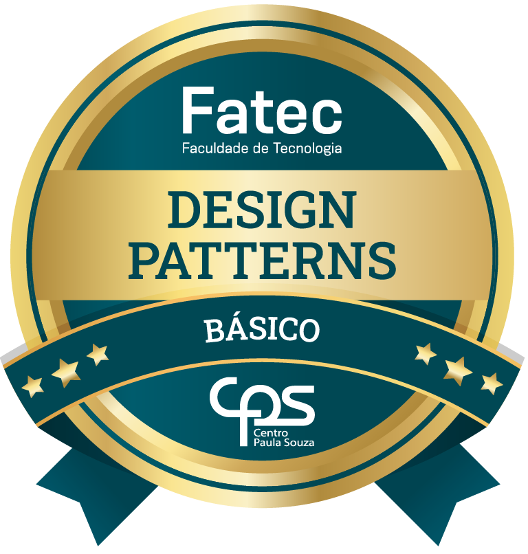
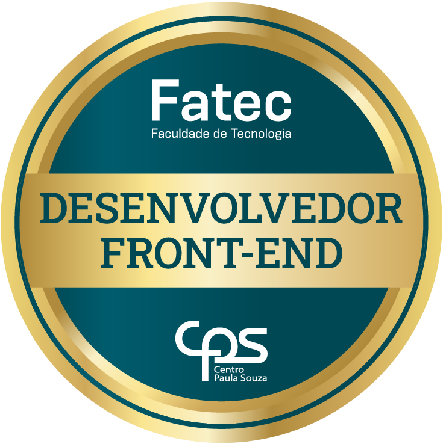

# 🌙 Olá! Eu sou a Luna Alves 🌙

> 📊 Graduanda em Desenvolvimento de Software Multiplataforma, com foco em **Análise de Dados e Business Intelligence**. Unindo modelagem, visão de negócio e lógica de programação para transformar dados em soluções estratégicas.

### 🛠️ Tecnologias de Dados & BI (Foco Principal)

### 💻 Desenvolvimento & Web (Suporte & Automação)

## 🏅 Microcertificações (Fatec)

  <!-- Badge Design Patterns -->
  
  
  <!-- Badge Desenvolvedor Front-End -->
  

